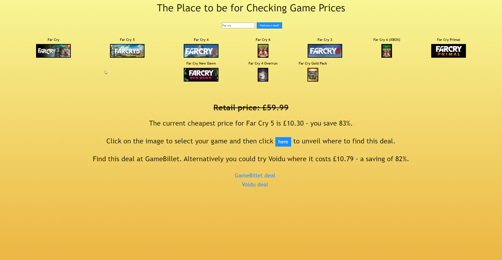

# Video Game Price Checker

This app searches a range of sites to find the best price for any game, providing information about retail price, savings by %, and offering an alternative site for every game. This app uses the CheapShark API. Upon reaching the site the user will be asked to log in and can then search for game in the search bar, select the game you want from the results by clicking on the image, and you're all set to start saving bundles of cash. You can log out at any time.

## Screenshots



## Installation

Install the app with npm

```bash
  npm install
  npm start
```

## Appendix

This project uses React.

## Deployment

To deploy this project run

```bash
  npm run build
```

This app is currently deployed at https://game-price-search.netlify.app/

## FAQ

#### Why do some games appear twice?

This appears to be one of the quirks of the API.

#### Why isn't the game for which I'm searching appearing?

It's likely your game isn't appearing on any of the sites tracked by the API.

#### Can I use this app on my mobile?

You can but it's not currently optimised for mobile.

## 🚀 About Me

I'm training as a full stack developer on the School of Code bootcamp.

## Support

For support, email roberthuwjones@outlook.com
